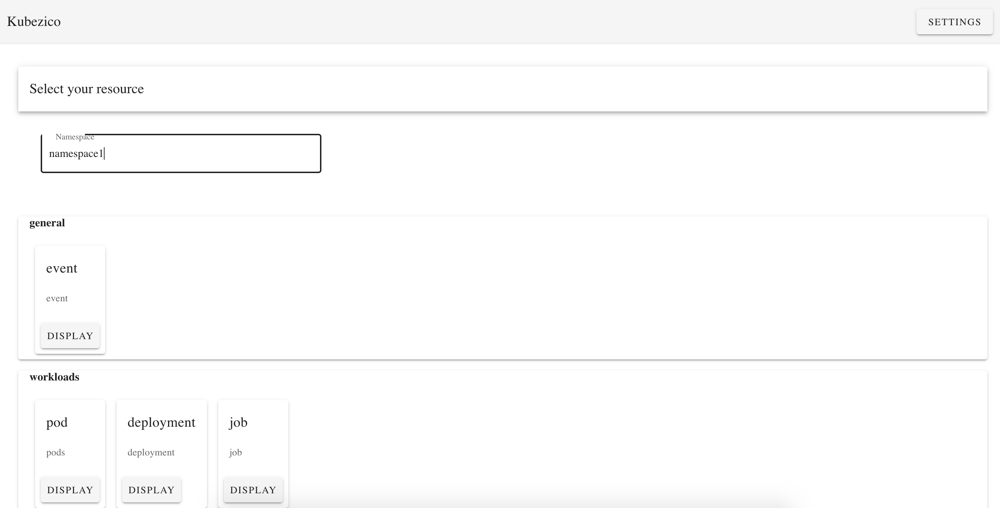
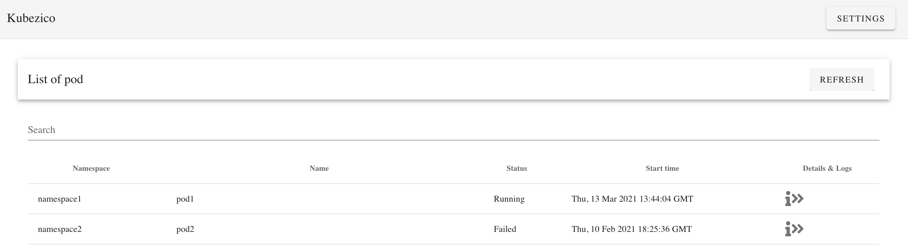
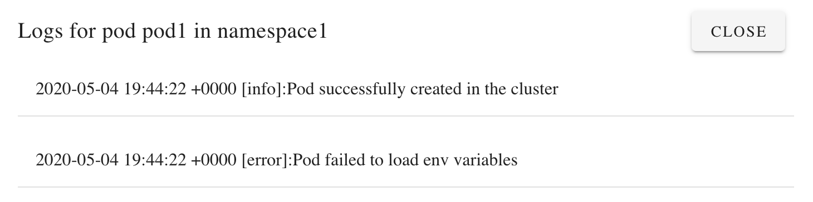

# kubezico

Kubezico is a simple application that let you see in realtime what is going on
inside your kubernetes cluster. You can use it directly with the executable or run it locally.

## Features

Kubezico is a very simple yet powerful kubernetes IDE. You can instantly see what resources are present in your cluster an filter by namespace if necessary:



At the moment you have access to:
* Pods, deployments and jobs
* Resource quotas, configmaps and secrets
* Ingress and services
* PVC and PV

Then you can select the resource type you want to see in more details and kubezico will automatically list all resources of this type in your cluster.



If you need more information for a given resource you can display the yaml (in json format) corresponding to this resource and even show logs (if your resource is a pod)



You can download it from github (in the releases tab) : https://github.com/mouchetm/kubezico/releases

As I am not an apple certified developer you will have to do this to be able to launch the app : https://support.apple.com/en-gb/guide/mac-help/mh40616/mac

## Running locally

Kubezico is composed of a backend (in Flask) and a frontend (in Vue).
Thanks to electron you can alos render the frontend as a desktop app.

### Backend

Create python virtualenv
```
python3 -m venv ./venv
```

Activate it
```
source venv/bin/activate
```

Install requirements
```
pip install -r requirements.txt
```

To run the dev server
```
flask run
```

### Frontend

Install dependencies

```
yarn install
```

If you want to render in the browser:

```
yarn serve
```

If you want to render as desktop app
```
yarn electron:serve
```

## Packaging

To make the use of this app easier for everybody we packaged it as a dmg. There is still
work to do to make in work in other systems that MacOs.
The packaging consists in a two steps process:
* We create an executable of the backend (thanks to pyinstaller)
* We create an executable for the frontend (electron)

### Packaging the flask app

Here the idea is to create a single executable file that contain our code + venv 
We are using pyinstaller (keep using the preivously created venv)
```
pip install pyinstaller
```

Create the executable
```
pyinstaller --onefile app.py
```

To make sure it works 
```
dist/app
```

### Packaging the frontend

Build the executable
```
yarn electron:build
```

Your dmg will be found there dist_electron/kubezico-0.1.0.dmg
